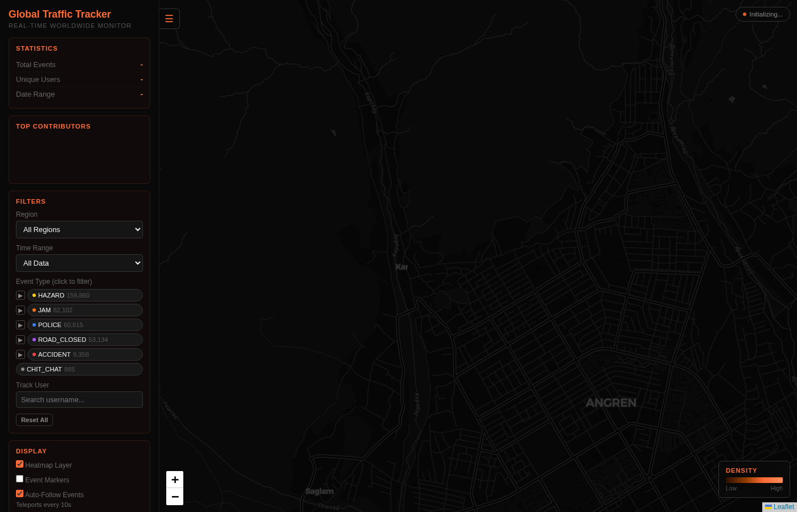
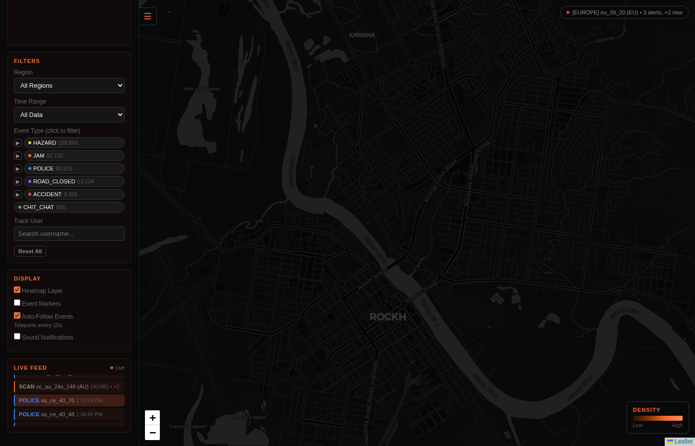

# Waze OSINT Tracker

[](https://pypi.org/project/waze-logs/)
[](https://www.python.org/downloads/)
[](https://opensource.org/licenses/MIT)

A worldwide data collection tool for Waze traffic events. Demonstrates location privacy risks in crowdsourced traffic applications.





## What It Does

Captures Waze traffic reports (police, jams, hazards, accidents, road closures) from **5 continents** including username, GPS coordinates, and timestamps. By collecting this data over time, it's possible to build movement profiles of individual users - demonstrating privacy implications of Waze's crowdsourced model.

**Based on research by [Covert Labs](https://x.com/harrris0n/status/2014197314571952167)**

## Quick Start

```bash
# Install
pip install waze-logs

# Run (starts collector + web UI in background)
waze start -b

# Open http://localhost:5000
```

That's it. The web UI shows a live map with events streaming in from around the world.

## Additional Commands

```bash
waze --help      # See all available commands
waze stop        # Stop the collector
waze logs        # Watch live output
```

## Privacy & Ethics

This tool is for **security research and education** - demonstrating privacy risks in Waze's design.

**Do not use for:**
- Stalking or tracking individuals
- Publishing identifiable data
- Any illegal surveillance

## License

MIT
