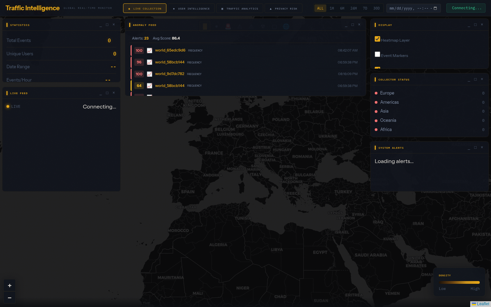
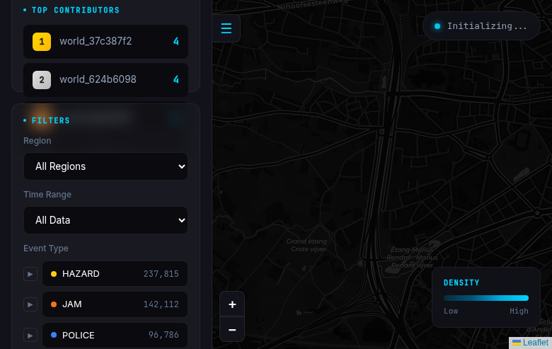
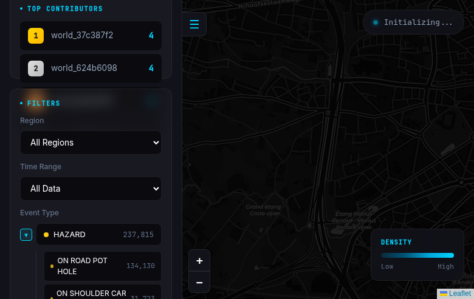

# Waze OSINT Tracker

[](https://pypi.org/project/waze-logs/)
[](https://www.python.org/downloads/)
[](https://opensource.org/licenses/MIT)

A worldwide data collection tool for Waze traffic events. Demonstrates location privacy risks in crowdsourced traffic applications.







## What It Does

Captures Waze traffic reports (police, jams, hazards, accidents, road closures) from **5 continents** including username, GPS coordinates, and timestamps. By collecting this data over time, it's possible to build movement profiles of individual users - demonstrating privacy implications of Waze's crowdsourced model.

**Based on research by [Covert Labs](https://x.com/harrris0n/status/2014197314571952167)**

## Install

```bash
# From PyPI
uv add waze-logs
# or
pip install waze-logs
```

## Quick Start

```bash
# Clone and sync dependencies
uv sync

# Run the CLI
uv run waze start -b

# Open http://localhost:5000
```

That's it. The web UI shows a live map with events streaming in from around the world.

## Development

```bash
# Sync all dependencies (including dev group)
uv sync

# Run tests
uv run pytest

# Lint code
uv run ruff check .

# Format code
uv run ruff format .

# Type check
uv run ty check .

# Add a new dependency
uv add <package>

# Add a dev dependency
uv add --dev <package>
```

## Additional Commands

```bash
waze --help      # See all available commands
waze stop        # Stop the collector
waze logs        # Watch live output
```

## Privacy & Ethics

This tool is for **security research and education** - demonstrating privacy risks in Waze's design.

**Do not use for:**
- Stalking or tracking individuals
- Publishing identifiable data
- Any illegal surveillance

## License

MIT

---

## Annex: Sample Data

### Collected Events

Here's what the raw collected data looks like - real events captured from the Waze network:

| Username | Type | Coordinates | Timestamp | Region |
|----------|------|-------------|-----------|--------|
| `user_a]1b2c3d4` | POLICE | 40.4168, -3.7038 | 2026-01-24 14:32:15 | Europe |
| `driver_x7y8z9` | HAZARD | 48.8566, 2.3522 | 2026-01-24 14:31:02 | Europe |
| `waze_usr_123` | JAM | 34.0522, -118.2437 | 2026-01-24 06:28:44 | Americas |
| `report_456` | ACCIDENT | -33.8688, 151.2093 | 2026-01-25 01:15:33 | Oceania |
| `user_tokyo_99` | ROAD_CLOSED | 35.6762, 139.6503 | 2026-01-24 23:45:18 | Asia |

### Event Types Breakdown

From a sample collection of ~365,000 events:

```
HAZARD       158,860  (43.5%)  - Road hazards, objects, weather
JAM           82,102  (22.5%)  - Traffic congestion reports
POLICE        60,615  (16.6%)  - Police sightings
ROAD_CLOSED   53,134  (14.6%)  - Road closures, construction
ACCIDENT       9,358   (2.6%)  - Crash reports
CHIT_CHAT        885   (0.2%)  - Community messages
```

### API Response Example

The `/api/events` endpoint returns data like this:

```json
{
  "events": [
    {
      "id": "eu_12345",
      "username": "driver_abc123",
      "latitude": 52.3676,
      "longitude": 4.9041,
      "timestamp": "2026-01-24T10:30:00+00:00",
      "report_type": "POLICE",
      "subtype": "POLICE_VISIBLE",
      "region": "europe",
      "grid_cell": "amsterdam"
    }
  ],
  "total": 1
}
```

### Coverage Statistics

The collector scans **8,656 grid cells** across 5 continents:

| Region | Cities (P1) | Coverage (P3) | Total Cells |
|--------|-------------|---------------|-------------|
| Europe | 477 | 1,748 | 2,225 |
| Americas | 693 | 1,692 | 2,385 |
| Asia | 684 | 1,517 | 2,201 |
| Oceania | 216 | 481 | 697 |
| Africa | 315 | 833 | 1,148 |
| **Total** | **2,385** | **6,271** | **8,656** |

### CLI Output Sample

```
$ waze start -b
Collector started in background
Web UI available at http://localhost:5000
Use 'waze logs' to watch output or 'waze stop' to stop

$ waze logs
[14:32:15] + POLICE       @  40.41680,   -3.70380 - user_a1b2c3d4
[14:32:17] + JAM          @  48.85660,    2.35220 (JAM_HEAVY_TRAFFIC) - driver_x7y8z9
[14:32:19] + HAZARD       @  51.50740,   -0.12780 (HAZARD_ON_ROAD) - london_user_42
```

---

<div align="center">

[](https://github.com/jasperan)&nbsp;
[](https://www.linkedin.com/in/jasperan/)

</div>

---

## Frontend Design

### UI Screenshots

The Waze Logger dashboard features a **Dark Map Intelligence** aesthetic with amber/gold accents on deep blue backgrounds.

#### Main Dashboard

*Real-time map view with event markers and statistics sidebar*

#### Event Details

*Detailed view of traffic events with filtering options*

#### User Tracking

*Tracked users panel with movement patterns*

#### Statistics Panel

*Data analytics and visualization charts*

### Design System

| Component | Description |
|-----------|-------------|
| **Color Palette** | Amber/gold (#E8A817) on deep navy (#06080C) |
| **Typography** | Instrument Sans for UI, IBM Plex Mono for data |
| **Layout** | Split-pane: map (main) + sidebar (data) |
| **Map Style** | Dark-themed Leaflet with custom markers |
| **Glass Effects** | Translucent panels with backdrop blur |

### Key UI Components

1. **Interactive Map** - Leaflet-based map with custom event markers
2. **Event Cards** - Glass-morphism cards showing alert details
3. **Filter Bar** - Toggle switches for event types (Police, Jam, Hazard, etc.)
4. **Stats Widgets** - Real-time counters with animated updates
5. **User List** - Scrollable list of tracked Waze users
6. **Time Filter** - Date range selector for historical data

> **Note**: Screenshots are stored in `assets/screenshots/`. Start the Flask server (`waze web`) to capture live screenshots.
